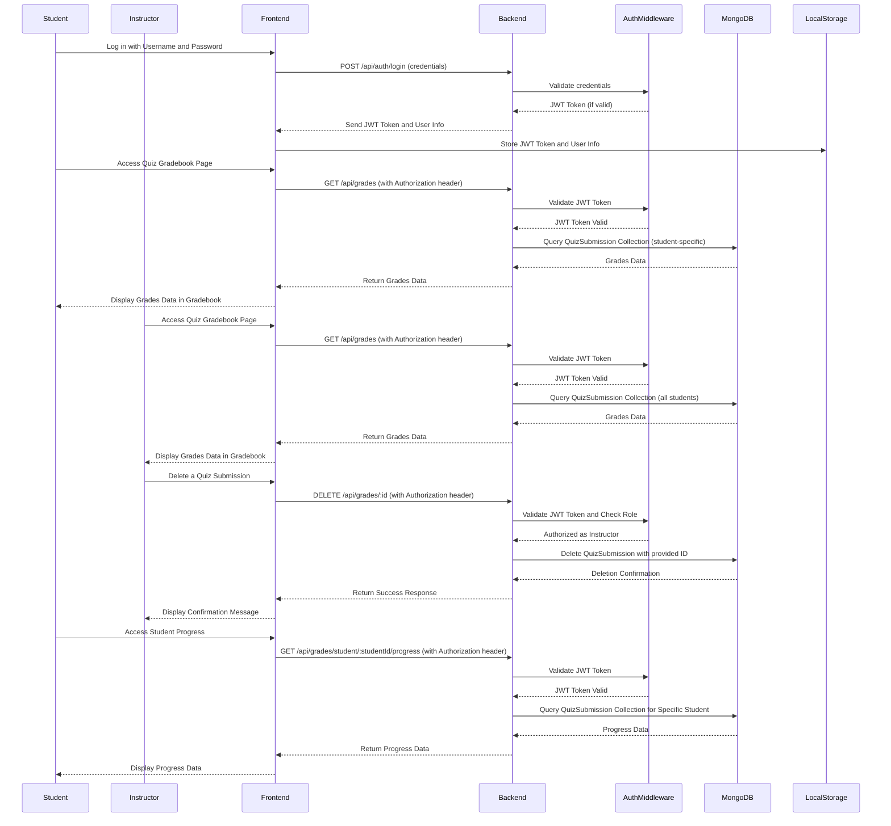

# Quiz Gradebook Application Overview

The **Quiz Gradebook Application** is a full-stack web platform designed to help students and instructors efficiently manage quiz submissions, scores, and progress tracking. Built with a modern technology stack, the project aims to provide an intuitive, secure, and feature-rich experience for both instructors and students. The application is built using **React** on the frontend, **Node.js/Express** for the backend, and **MongoDB** as the database, ensuring scalability, responsiveness, and ease of use.

## Project Goals

The main goal of the Quiz Gradebook Application is to create an efficient way for instructors to manage quizzes and track student progress while allowing students to easily access and view their grades. This system provides role-based access, enabling different functionalities for instructors and students based on their roles, ensuring secure and role-appropriate data access.

## Key Features

- **User Authentication and Authorization**: The application uses **JWT-based authentication** to manage user sessions, ensuring only authorized users can access the system's features. Role-based access control allows instructors to have additional privileges, such as viewing all students' grades and deleting quiz submissions.

- **Role-Based Gradebook Access**: Instructors can view the grades for all students in a class, while students can only access their personal quiz scores and progress. This feature is designed to maintain data privacy and ensure secure data access for different user roles.

- **Quiz Submission Management**: Instructors have the ability to manage quiz submissions, including deleting submissions. This feature is helpful for maintaining accurate records and removing incorrect or duplicate entries.

- **Student Progress Tracking**: Students can access a detailed view of their progress across quizzes. Instructors can view the progress of individual students as well as the overall class, allowing them to better support their students and make informed decisions about where to focus their teaching efforts.

## Technologies Used

- **Frontend**: The user interface is built with **React**, providing a dynamic and responsive user experience. State management is used to handle user sessions and data updates seamlessly.

- **Backend**: The server-side logic is implemented using **Node.js** and **Express**. The backend is responsible for processing requests, interacting with the database, and enforcing business logic, such as role-based permissions.

- **Database**: The application uses **MongoDB** for data persistence. Collections include users, quizzes, and quiz submissions, which store the necessary information to manage the quiz workflows.

- **Authentication and Authorization**: **JWT (JSON Web Token)** is used to ensure that users are authenticated, and **middleware** is employed for role-based access control. The middleware validates JWT tokens and checks user roles to determine access permissions.

## How It Works

The application begins with a login process, where users (students or instructors) authenticate themselves using a username and password. Upon successful authentication, users receive a JWT token, which is used to access protected routes within the application.

The **Quiz Gradebook** is accessible after successful login:

- **Students** can navigate to the gradebook to see their quiz scores and overall progress. They can only view their personal grades, ensuring privacy.
- **Instructors** have additional privileges, allowing them to view the scores of all students in a particular quiz and manage quiz submissions.

Instructors also have the option to **delete quiz submissions**, which helps maintain the accuracy of the records. Students, on the other hand, can access their **progress data**, including the number of quizzes taken and their average scores.

The **backend** is designed to handle these interactions efficiently, with **middleware** to validate requests and enforce **role-based permissions**. Data is stored in **MongoDB**, which ensures scalability and flexibility in managing quiz data and user information.

## Project Structure

The application is organized into three main layers:

1. **Frontend (React)**: Handles the user interface, capturing user inputs and displaying quiz and progress data.
2. **Backend (Express Server)**: Processes API requests, applies business logic, and interacts with the database.
3. **Database (MongoDB)**: Stores persistent data, such as user information, quizzes, and quiz submissions.

## Use Cases

- **Instructors** can use the application to track student performance, view missed quiz questions, and help students improve their understanding of the course material.
- **Students** can access the application to view their quiz scores, understand their progress, and identify areas that require further study.

## Future Improvements

The current implementation of the Quiz Gradebook Application is focused on providing core functionalities for managing quizzes and grades. Future improvements could include:

- **Enhanced Analytics**: Adding more detailed analytics for instructors to track class performance over time.
- **Notifications**: Implementing email or in-app notifications for students to be alerted about new quizzes or feedback from instructors.
- **Integration with LMS**: Integrating with popular Learning Management Systems (LMS) to provide a seamless experience for both students and educators.
- **Additional Roles**: Adding more user roles, such as administrators, who can manage quizzes across multiple courses or instructors.

## Summary

The Quiz Gradebook Application is a well-structured, scalable solution for managing quizzes, scores, and progress tracking. With its focus on role-based access control, modern technology stack, and intuitive user experience, it serves as a valuable tool for both instructors and students. This project demonstrates the use of **React**, **Node.js**, and **MongoDB** to create an application that meets the needs of different types of users while ensuring security, usability, and maintainability.

# UML Sequence Diagram for Quiz Gradebook Application

This sequence diagram represents the interactions between different parts of the quiz gradebook application. The participants include the Student, Instructor, Frontend, Backend (Express Server), Auth Middleware, and MongoDB Database.

## Participants
- **Student/Instructor**: End users of the application.
- **Frontend (React)**: User interface components like Login and QuizGradebook.
- **Backend (Express Server)**: Server-side logic implemented using Node.js and Express.
- **Auth Middleware**: Middleware used for authentication and authorization of users.
- **MongoDB Database**: Stores information such as users, quizzes, and grades.

## Sequence Diagram (Textual Representation)

## Description of Sequence

1. **Login Sequence**
   - The user (either a student or instructor) provides credentials, which are sent to the backend for validation.
   - The backend generates a JWT token upon successful validation, which is then returned to the frontend.
   - The frontend stores the JWT token and user information in local storage for future authentication needs.

2. **Access Quiz Gradebook (Student and Instructor)**
   - The user navigates to the quiz gradebook page.
   - The frontend sends a GET request to the `/api/grades` endpoint with the JWT token.
   - The backend validates the JWT token using auth middleware.
   - **Student**: The backend queries the `QuizSubmission` collection for the specific student, returning only their grades.
   - **Instructor**: The backend queries the `QuizSubmission` collection for all students.
   - The backend sends the appropriate grades data to the frontend for display.

3. **Delete Quiz Submission (Instructor Only)**
   - The instructor initiates a delete action on a specific quiz submission.
   - The frontend sends a DELETE request to the `/api/grades/:id` endpoint with the JWT token.
   - The backend uses auth middleware to validate the token and verifies the role as `instructor`.
   - If authorized, the backend deletes the quiz submission from the `QuizSubmission` collection and returns a success message to the frontend.
   - The frontend updates the gradebook display accordingly.

4. **Student Progress Access**
   - The student accesses their progress page.
   - The frontend sends a GET request to `/api/grades/student/:studentId/progress`, attaching the JWT token.
   - The backend validates the JWT token and queries the `QuizSubmission` collection for the specific student.
   - The backend returns the progress data to the frontend for display.

## Summary

This sequence diagram represents the interactions between different parts of the application during core activities such as logging in, viewing the gradebook, deleting a submission, and accessing student progress. Key points include JWT-based authentication, role-based access control, and CRUD operations involving the `QuizSubmission` collection in MongoDB.

- **Auth Middleware**: Plays a crucial role in verifying users' identities and authorizing actions based on roles (e.g., student vs. instructor).
- **Frontend (React)**: Sends requests, displays data, and provides a seamless user experience.
- **Backend (Express Server)**: Handles server-side logic, communicates with the database, and returns results to the frontend.
- **MongoDB**: Stores and manages the data related to quizzes, submissions, and user information.

## Markdown Representation

The textual sequence diagram above is intended to be added to a `README.md` file. The sequence diagram uses common UML conventions to represent the flow between components using arrows:

- **->>**: Represents a synchronous call.
- **-->>**: Represents a return message.
- **participant**: Defines the components involved in the sequence.

Feel free to adjust any descriptions or participants as your application evolves.

